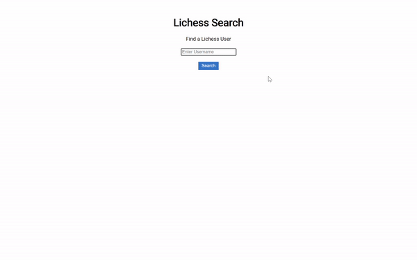

# Lichess Search

Lichess Search is a single-page application that utilizes the [Lichess API](https://lichess.org/api) to allow a user to search for Lichess players by username and see their ratings and recent games. This application allows a user to see all of a player's recent games together, regardless of time format.

### Features

- Displays a player's ratings
- Displays a player's recent games
- When a game is selected, an interactive board is displayed
- Games can be filtered by the opening that was played

### [Visit Lichess Search](https://e4c5nf3d6.github.io/phase-1-project/)

One of endpoints that I used streams its responses as NDJSON. [This post](https://dev.to/e4c5nf3d6/complications-and-simplifications-creating-a-chess-application-5c18-temp-slug-2822270?preview=4e7da3af2b5a1294eb112e3dec27da5316abaa1842f581ff5a2e098eb817db4bb87c0e468245af382e12542a4e60c168198ba7e8a504cb5c4f7ce469) addresses some of the challenges that this presented during the development of this application, as well as how they were ultimately resolved.

## Example

## Technologies
- JavaScript
- HTML
- CSS

## Acknowledgments

Thank you to Lichess: a free, open-source chess server.